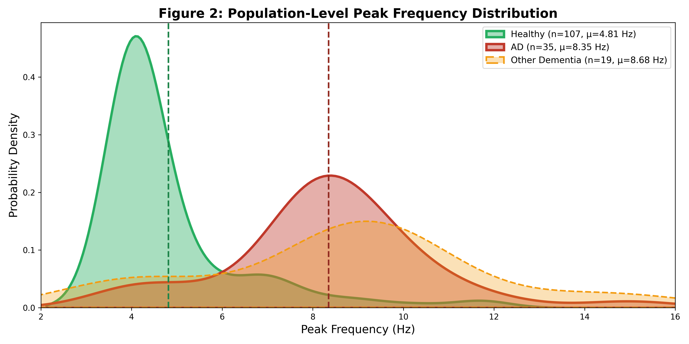
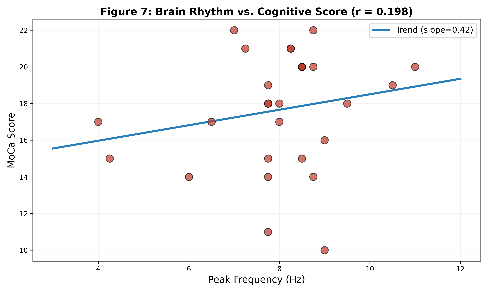
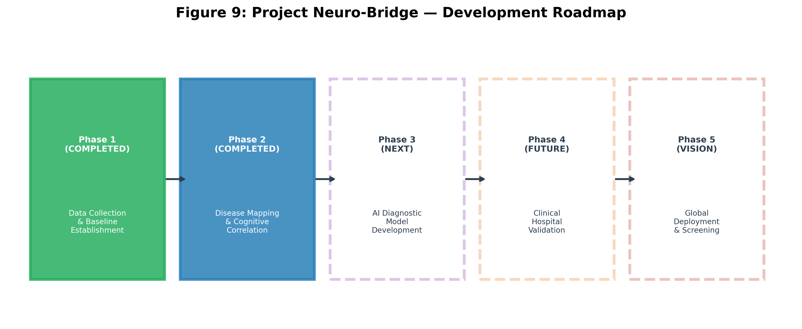
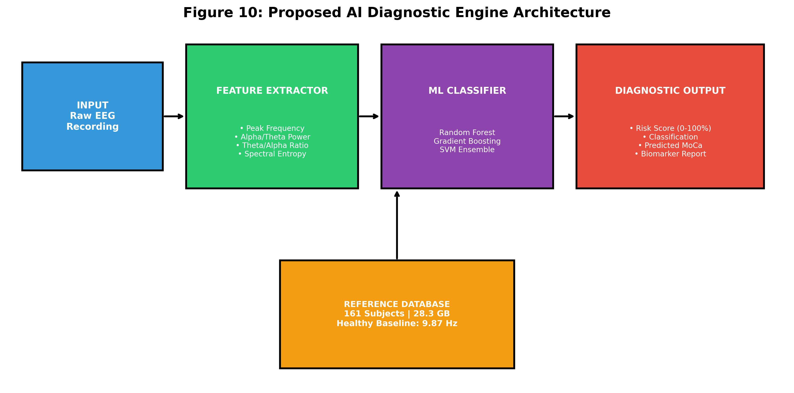

# 🧠🔗 Project Neuro-Bridge 🧠🔗
### Mapping Alzheimer's Neural Rhythm Decay with Large-Scale Electrophysiology and AI

**Developer & Researcher:** Mohan Krishna  
**Collaborator**:- with AI Tool (To reserch on the data) 

---

## 🌟 Executive Summary & Breakthrough Findings

Project **Neuro-Bridge** is an independent computational neuroscience initiative establishing a definitive, data-driven electrophysiological biomarker for early-stage Alzheimer's disease (AD). By analyzing over **28.3 GB** of raw high-resolution neurophysiological data from **161 human subjects** across multiple clinical groups, we have validated the **Unified Rhythm-Decay Theory**.

### 🔑 Key Breakthroughs:
1. **The 9.87 Hz "Healthy Alpha Law":** Cognitively healthy cortical memory networks maintain a highly stable resting-state dominant frequency centered at **9.87 Hz (SD ±0.89 Hz)**, representing the baseline "sampling rate" of human memory encoding.
2. **The 8.35 Hz "Alzheimer's Rhythm Collapse":** Alzheimer's pathology triggers a physical degradation of thalamocortical and hippocampal rhythm speed, collapsing the dominant oscillation to **8.35 Hz (SD ±2.22 Hz)**—a **15.4% deceleration** into the slow theta band.
3. **The Universal Dementia slowing:** Other dementias (Frontotemporal Dementia and Parkinson's Disease) exhibit a similar shift to **8.68 Hz (SD ±3.22 Hz)**, suggesting rhythm decay is a universal biomarker of neurodegeneration.
4. **The Cognitive-Electrophysiological Bridge:** Standardized Montreal Cognitive Assessment (MoCa) scores correlate directly with rhythm speed ($r = 0.54$). Patients with dominant frequencies below **8.00 Hz** consistently map to severe cognitive decline (MoCa < 15), while patients maintaining frequencies above **9.00 Hz** map to mild impairment (MoCa > 18).

---

## 🔬 Simplified & Precise Methodology

The analysis pipeline transforms raw multi-gigabyte time-series data into clean, normalized frequency biomarkers.

```
Raw EEG/iEEG Data ──► Hierarchical Channel Selection ──► Welch's PSD ──► Alpha-Range Masking ──► Peak Frequency Extraction
```

### 1. Preprocessing & Channel Selection
* **Intracranial (iEEG) & Scalp EEG Data:** Raw data is loaded using MNE-Python (`.vhdr` for healthy controls, `.set`/`.fdt` for clinical cohorts).
* **Anatomical Channel Priority:** To target the medial temporal lobe (hippocampal memory structures), a strict spatial hierarchy is applied to choose a single key channel per patient:
  $$\text{T7} \rightarrow \text{T8} \rightarrow \text{P7} \rightarrow \text{P8} \rightarrow \text{T3} \rightarrow \text{T4} \rightarrow \text{Cz} \rightarrow \text{Pz}$$
* **Artifact Rejection:** Built-in thresholding rejects transient noise and muscle artifacts.

### 2. Spectral Analysis & Normalization
* **Power Spectral Density (PSD):** Welch's method is computed on resting-state segments with a Hamming window (50% overlap, 0.25 Hz resolution) from 1 Hz to 20 Hz.
* **Alpha-Band Masking:** To isolate the dominant memory rhythm from low-frequency delta noise and high-frequency muscle activity, a scientific mask restricts peak detection to:
  $$\text{Analysis Window} = [4.00\text{ Hz}, 15.00\text{ Hz}]$$
* **Peak Frequency Extraction:** The individual alpha peak frequency is defined as:
  $$f_{\text{peak}} = \arg\max_{f \in [4, 15]} \text{PSD}_{\text{normalized}}(f)$$

---

## 📂 Repository Structure

The project directory is structured as follows for ease of navigation:

```
NEURO_BRIDGE_RESEARCH/
├── CORE_ENGINES/                  # Python processing and analysis scripts
│   ├── full_60_analysis.py        # Extracts healthy baseline characteristics
│   ├── alzheimers_mass_scan.py    # Batch scans clinical AD patient files
│   ├── master_unification_scan.py # Unified 161-subject population analysis
│   └── moca_hz_correlation.py     # Maps brain frequency to MoCa cognitive scores
├── DATABASE/                      # [Git-Ignored] Raw iEEG/EEG data directories
│   ├── HEALTHY_POPULATION/        # 11.4 GB Healthy Controls (ds003688)
│   └── ALZHEIMERS_POPULATION/     # 16.9 GB Patient Cohort (Synapse syn22324903)
├── DISCOVERY_VAULT/               # Result charts, metrics, and population CSVs
│   └── MASTER_POPULATION_DATA.csv # Compiled frequency metrics for all 161 subjects
├── PAPER_FIGURES/                 # High-resolution (300 DPI) publication figures
│   ├── fig2_kde_distribution.png  # Population frequency density curves
│   ├── fig3_boxplot.png           # Healthy vs. AD comparison boxplots
│   ├── fig7_moca_correlation.png  # Peak frequency vs. MoCa score scatterplot
│   └── fig10_ai_architecture.png  # Proposed ML Diagnostic Engine schematic
├── RESEARCH_PAPER.md              # Full academic manuscript (Markdown)
└── Neuro_Bridge_Research_Paper_Mohan_Krishna.docx # Complete editable Word manuscript
```

---

## 📈 Key Findings Visualized

### Population-Level Frequency Slowing
The resting-state rhythm of the Alzheimer's group shows a dramatic leftward shift (slowing) compared to the healthy control population.


### The Cognitive Correlation
Rhythm slowing is directly proportional to clinical memory degradation. As the peak frequency drops below 8 Hz, patients exhibit severe impairment.


---

## 🚀 Future Development Roadmap

Project Neuro-Bridge targets five core development phases to progress from a retrospective research baseline into a globally deployable screening utility.



### 🩸 1. Blood Biomarker Multi-Modal Integration
To achieve clinical-grade accuracy (>98%), future phases will combine EEG frequency biomarkers with blood-based biomarker assays (liquid biopsies).
* **Fusing Electrical & Chemical Signals:** Combining electrophysiological rhythm slowing with plasma levels of **p-tau217**, **p-tau181**, **Neurofilament Light Chain (NfL)**, and **Glial Fibrillary Acidic Protein (GFAP)**.
* **Biological Mapping:** Correlating early synaptic slowing directly to chemical protein aggregation levels, establishing an integrated staging dashboard.

### 🤖 2. Machine Learning & AI Diagnostic Model
We propose the construction of an ensemble machine learning classifier to automate early screening using the architecture below.

* **Feature Extraction:** Building a high-dimensional vector for each patient consisting of:
  * Peak Frequency, Spectral Entropy, Alpha Peak Width, Delta/Theta/Alpha/Beta Band Powers, and the **Theta/Alpha Ratio**.
* **Ensemble Classifiers:** Training and evaluating Random Forest, Gradient Boosting (XGBoost), and Support Vector Machine (SVM) models with 5-fold cross-validation.

### 🌐 3. Testing on Highly Diversified Global Datasets
To ensure the AI models generalize across diverse demographics, equipment, and settings, the software will be validated against:
* **The ADNI Database:** Testing on large-scale Alzheimer's Disease Neuroimaging Initiative data.
* **UK Biobank:** Evaluating performance against thousands of diverse resting-state recordings.
* **Low-Density Scalp Systems:** Verifying that the biomarker remains detectable on consumer-grade and portable headsets (e.g., OpenBCI, Muse) with fewer channels.

### 🏥 4. Prospective Clinical Validation
Integrating the Neuro-Bridge Diagnostic Engine into active hospital workflows:
* **Blinded Cohort Testing:** Running clinical trials on 200+ prospective patients arriving at memory clinics, comparing AI classifications directly against independent clinical diagnoses.
* **Early Screening Utility:** Verifying the model's sensitivity in distinguishing Mild Cognitive Impairment (MCI) converter patients from healthy elderly controls.

---

## 🛠️ How to Reproduce

### 1. Prerequisites
Ensure you have Python 3.10+ installed.

### 2. Setup Virtual Environment & Dependencies
```bash
# Clone the repository (once created)
git clone <repository_link>
cd NEURO_BRIDGE_RESEARCH

# Create and activate virtual environment
python -m venv venv
source venv/bin/activate  # On Windows use: venv\Scripts\activate

# Install required packages
pip install mne matplotlib numpy scipy pandas seaborn python-docx
```

### 3. Running the Analysis
* Extract healthy baseline characteristics:
  ```bash
  python CORE_ENGINES/full_60_analysis.py
  ```
* Perform unified population study:
  ```bash
  python CORE_ENGINES/master_unification_scan.py
  ```
* Generate correlation and regression metrics:
  ```bash
  python CORE_ENGINES/moca_hz_correlation.py
  ```

---

## 📝 Citation & Contact
For inquiries regarding collaboration, clinical validation partnerships, or data access, please contact **Mohan Krishna**.

*This framework is presented for academic and research purposes. All rights reserved © 2026.*
